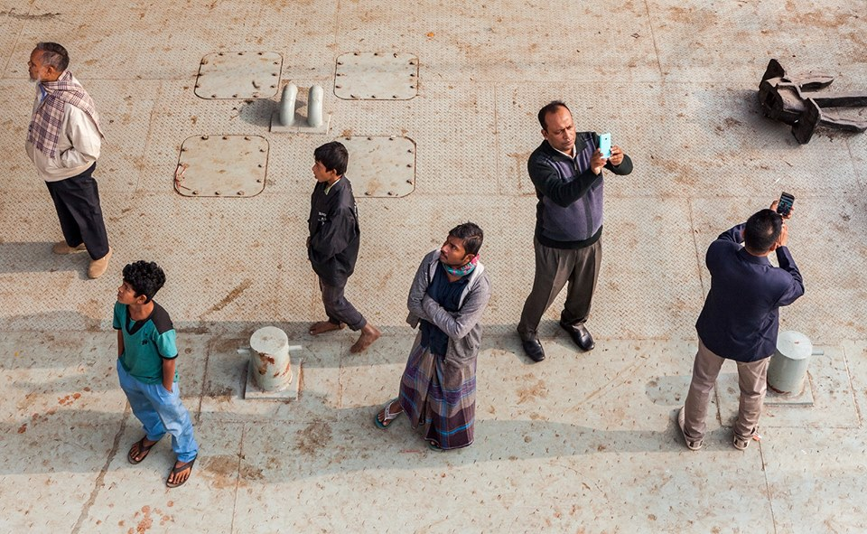

Image Captioning with Transformers for Bangla Dataset
========
PyTorch training code and pretrained models for **CATR** (**CA**ption **TR**ansformer).


### Samples:

<p align="center">
  
</p>
 কযেকজন মানষ আছে ।


<p align="center">
  
</p>
 একজন পরষ একটি রিকসা চালিযে যাচছে ।


<p align="center">
  
</p>
একটি মেযে শিশ তাকিযে আছে ।


<p align="center">
  
</p>
 একজন নারী মোবাইল এ কথা বলছে ।


# Google colab:

link for the colab file:
```
https://colab.research.google.com/drive/12qcRsNk8SiI5PVQN6FOHXP9Oe24t-yeO#scrollTo=7kRaXYBDQCd2
```
link for the files in google drive:
```
https://drive.google.com/drive/folders/19M5LcM6i-hBE1462as0-OoIJgALnRUQ3?usp=sharing
```
# Usage 

First, clone the repository locally:
```
$ git clone https://github.com/saidulK/catr_for_bangla
```
Then, install PyTorch 1.5+ and torchvision 0.6+ along with remaining dependencies:
```
$ pip install -r requirements.txt
```
That's it, should be good to train and test caption models.

## Data preparation

Download and extract BanglaLekhaImageCaptions images with annotations from: ```https://data.mendeley.com/datasets/rxxch9vw59/2)```.
The directory is expected to be like:
```
catr/ repository
Bangla Dataset/ dataset
```

Run ```Dataset Preprocessing.ipynb ``` to generate the training, validations and annotations folder


```
path/to/Bangla Dataset/
  images/  # images of dataset
  captions # captions json file
  training/ #training images
  validation/ #validation images
  annotations/ #annotations for the images
```

## Training
Tweak the hyperparameters from <a href='https://github.com/saahiluppal/catr/blob/master/configuration.py'>configuration</a> file.

To train baseline CATR on a single GPU for 30 epochs run:
```
$ python main.py
```
We train CATR with AdamW setting learning rate in the transformer to 1e-4 and 1e-5 in the backbone.
Horizontal flips, scales an crops are used for augmentation.
Images are rescaled to have max size 299.
The transformer is trained with dropout of 0.1, and the whole model is trained with grad clip of 0.1.

## Testing

To test the model with your own images check Prediction.ipynb. Change the image path and run the code.

# License
CATR is released under the Apache 2.0 license. Please see the [LICENSE](LICENSE) file for more information.
